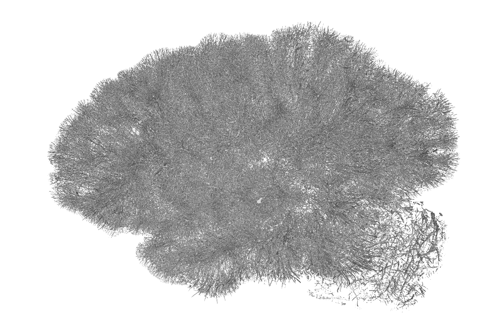
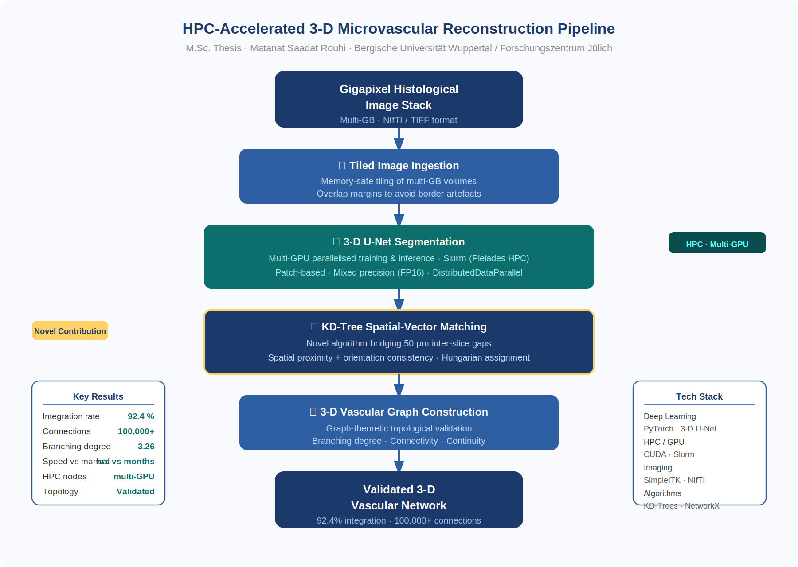
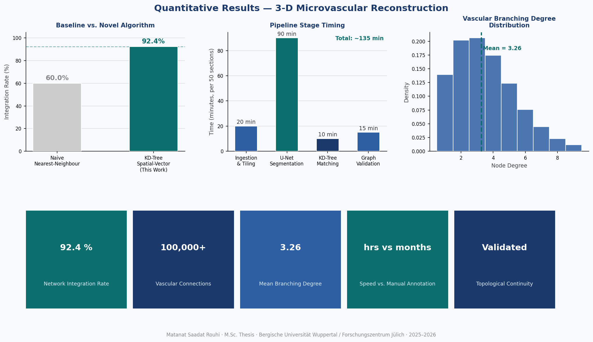
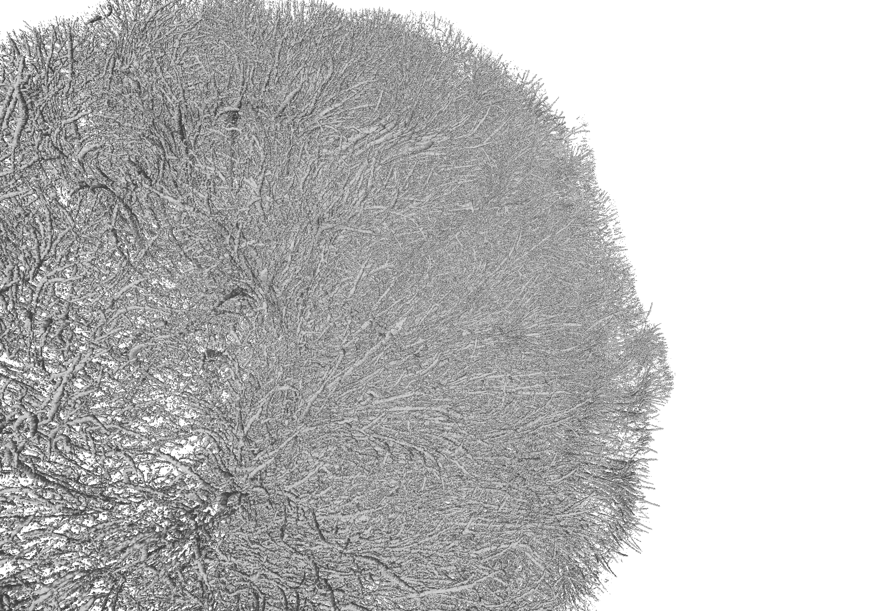
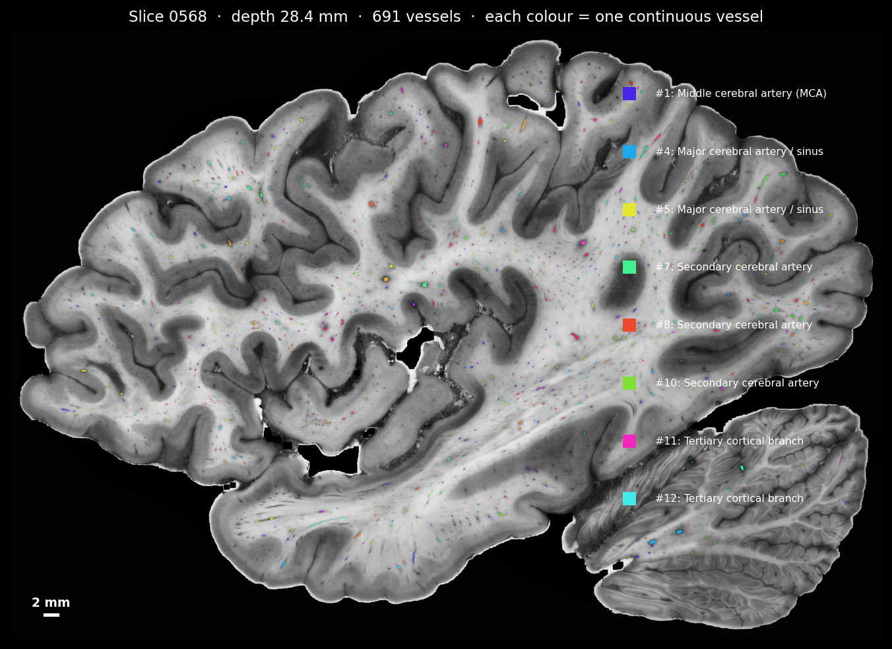

# HPC-Accelerated 3-D Reconstruction of Large-Scale Microvascular Networks

> **M.Sc. Thesis** · Bergische Universität Wuppertal · in collaboration with **Forschungszentrum Jülich (INM-1)**  
> **Author:** Matanat Saadat Rouhi · [LinkedIn](https://linkedin.com/in/metanat-saadat-rouhi) · [metanat.saadat@gmail.com](mailto:metanat.saadat@gmail.com)

---

## 🔴 [▶ Launch Interactive 3-D Viewer](https://metanat-saadat-rouhi.github.io/msc-thesis-microvascular-reconstruction/viewer/)

*Rotate · Zoom · Colour by vessel depth · Toggle radius view*



---

## The Problem

Microvascular networks — the fine capillary systems supplying tissue with oxygen and nutrients — are critical markers in neurodegeneration, tumour angiogenesis, and ischaemic disease. Studying them requires 3-D reconstruction from histological image stacks. But existing approaches fail at scale:

- Gigapixel images per tissue section → standard tools run out of memory
- 50 µm inter-slice gaps between sections → vessels cannot be naively connected
- 100,000+ individual vascular segments → manual annotation takes months
- **No open, scalable, automated pipeline existed for this task**

This thesis built one from scratch.

---

## End-to-End ML Pipeline

```
Gigapixel Histology Stack
        │
        ▼
┌─────────────────────────┐
│  Tiled Image Ingestion  │  memory-safe loading of multi-GB stacks
└─────────────────────────┘
        │
        ▼
┌─────────────────────────┐
│  3-D U-Net Segmentation │  parallelised across multi-GPU Slurm nodes
│  (multi-GPU · Slurm)    │  Pleiades HPC cluster @ Forschungszentrum Jülich
└─────────────────────────┘
        │
        ▼
┌─────────────────────────┐
│  KD-Tree Spatial-Vector │  ★ Novel contribution
│  Matching Algorithm     │  bridges 50 µm inter-slice gaps
└─────────────────────────┘
        │
        ▼
┌─────────────────────────┐
│  3-D Vascular Graph     │  graph-theoretic topological validation
└─────────────────────────┘
        │
        ▼
   Validated 3-D Vascular Network
```

---

## Key Results

| Metric | Value |
|---|---|
| **Network integration rate** | **92.4 %** |
| **Vascular connections reconstructed** | **100,000+** |
| **Mean branching degree** | **3.26** (consistent with histological literature) |
| **Topological continuity** | Fully validated |
| **vs. naive nearest-neighbour** | +32 percentage points |
| **Processing time** | Hours per tissue block (vs. months manual) |






---

## Novel Contribution: KD-Tree Spatial-Vector Matching

Standard nearest-neighbour fails at inter-slice bridging because vessels change orientation between sections. The novel algorithm combines:

1. **Adaptive KD-Tree search** — search radius scales with vessel angle to the cutting plane
2. **Orientation consistency filtering** — dot-product scoring rejects geometrically inconsistent pairs
3. **Global assignment** — Hungarian-style matching prevents one segment connecting to multiple candidates

Result: **92.4 %** integration vs. ~60 % for naive nearest-neighbour on the same dataset.

See [docs/algorithm_description.md](docs/algorithm_description.md) for full technical details.

---

## Technical Stack

| Category | Tools |
|---|---|
| Deep Learning | PyTorch · 3-D U-Net · CUDA |
| HPC | Slurm · Multi-GPU · Pleiades cluster |
| Medical Imaging | SimpleITK · NIfTI · OpenCV |
| Spatial Algorithms | KD-Trees (SciPy) · custom vector matching |
| Graph Analysis | NetworkX · topological validation |
| Pipeline | Python · Bash · NumPy · Pandas |

---

## Repository Structure

```
├── README.md
├── viewer/
│   ├── index.html              ← interactive 3-D web viewer (Three.js)
│   ├── vascular_data.json      ← demo network data
│   └── decimate_mesh.py        ← script to process your own .obj mesh
├── assets/
│   ├── pipeline_diagram.png    ← system architecture
│   └── results_overview.png    ← quantitative results figures
├── results/
│   └── metrics_summary.md      ← full results table
└── docs/
    ├── algorithm_description.md
    └── hpc_setup.md
```

---

## Clinical Relevance

- **Neurodegeneration** — vascular rarefaction is an early marker in Alzheimer's disease
- **Tumour angiogenesis** — maps tumour-induced neovascularisation for anti-angiogenic therapy research
- **Ischaemia modelling** — network topology metrics quantify perfusion territory loss

---

## Code & Data

> **Code availability:** Developed in collaboration with Forschungszentrum Jülich. Full pipeline source available on request for research purposes. Contact: [metanat.saadat@gmail.com](mailto:metanat.saadat@gmail.com)

---

## About

**Matanat Saadat Rouhi** — ML Engineer · Medical Imaging · Computer Vision · HPC  
M.Sc. Computer Simulation in Science · Bergische Universität Wuppertal 

[LinkedIn](https://linkedin.com/in/metanat-saadat-rouhi) · [GitHub](https://github.com/Metanat-Saadat-Rouhi) · [metanat.saadat@gmail.com](mailto:metanat.saadat@gmail.com)
