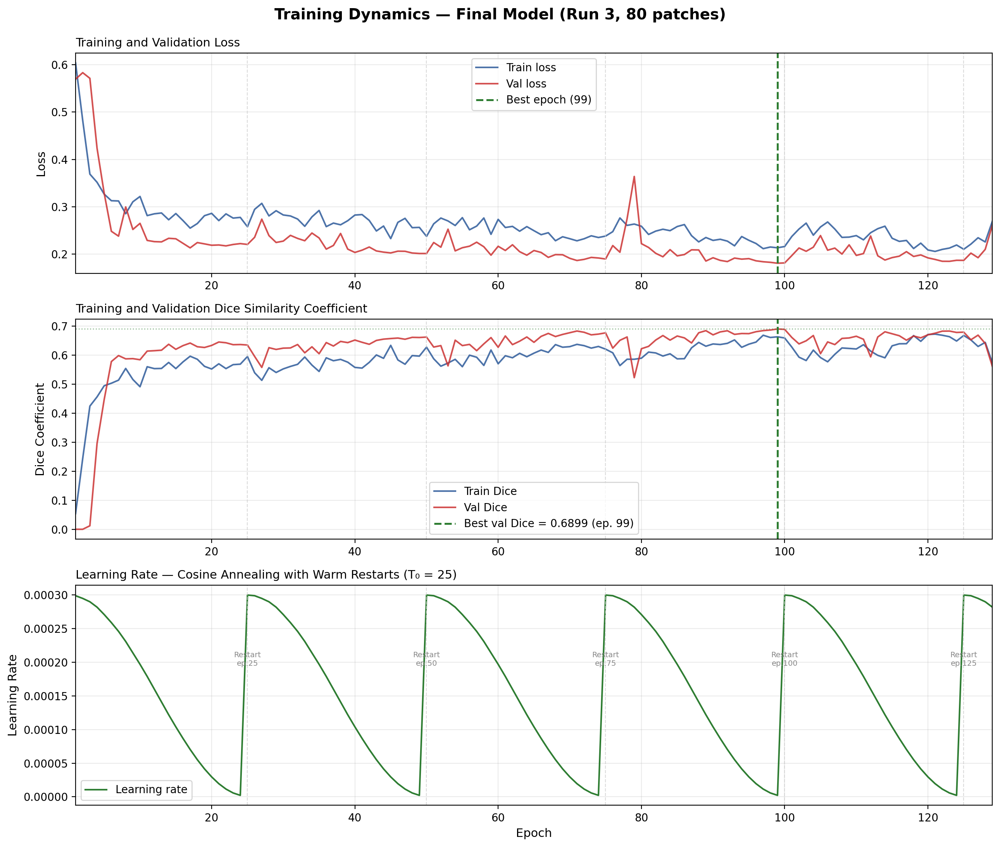
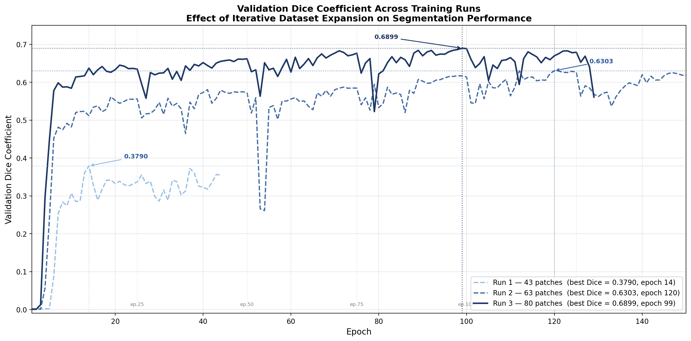
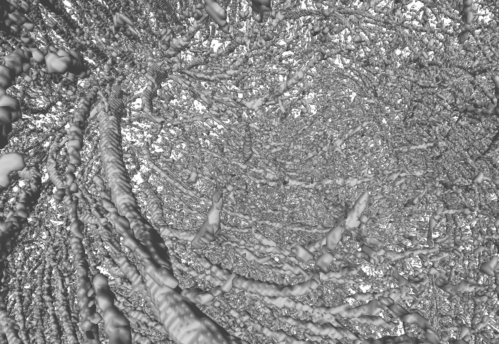

# Deep Learning Cerebrovascular Segmentation and 3D Reconstruction
<p align="center">
  
</p>

<p align="center">
  
</p>

<p align="center">
  <em>Complete vascular network of a human brain hemisphere — every thread is a real blood vessel, detected automatically by a deep learning model trained on 80 annotated patches and reconstructed across 62.9 mm of brain tissue.</em>
</p>

<p align="center">
  <a href="https://linkedin.com/in/metanat-saadat-rouhi">LinkedIn</a> ·
  <a href="mailto:metanat.saadat@gmail.com">Contact</a> ·
  <a href="https://metanat-saadat-rouhi.github.io/msc-thesis-microvascular-reconstruction/viewer/">Interactive 3D Viewer ↗</a>
</p>

---

## Overview

This repository presents the work from my M.Sc. thesis at Bergische Universität Wuppertal, conducted in collaboration with Forschungszentrum Jülich (INM-1).

The project addresses a fundamental challenge in neuroscience: automatically mapping the complete cerebrovascular network of a human brain hemisphere from serial histological sections — at the resolution of individual vessels, across the full brain depth, without manual tracing.

The pipeline takes 1,258 sequential brightfield scanner images of brain tissue (72 GB raw data) and produces a complete 3D surface mesh of the vascular network with quantified inter-slice connectivity.

---

## Results

| Metric | Value |
|---|---|
| Validation Dice (DSC) | **0.6899** |
| Improvement over standard baseline | **+0.688 Dice** |
| Training time on NVIDIA A100 | **11.8 minutes** |
| Brain sections processed | **1,258** · 5,472 × 3,648 px · 72 GB |
| Physical depth reconstructed | **62.9 mm** |
| 3D mesh vertices | **5,959,534** |
| Inter-slice connectivity | **61.88%** across 1,224 central sections |
| Broken vessel connections in tissue | **0** |
| Training data | **80** manually annotated patches |
| Class imbalance | **123:1** background-to-vessel ratio |

---

## The Core Engineering Challenge

Blood vessels occupy only **0.36% of image pixels** in brightfield histological sections — a 123:1 background-to-vessel ratio. Standard training with binary cross-entropy loss converges to predicting background everywhere:

- BCE baseline: Dice = **0.001** — detects zero vessels
- This pipeline: Dice = **0.6899**

The key contribution is a **density-aware composite loss function** that switches between three training regimes based on the measured vessel pixel density in each batch. This single design decision accounts for the full 0.688 Dice improvement over the baseline and is the enabling condition for deep learning on this dataset.

<p align="center">
  
</p>

<p align="center">
  <em>Validation Dice over 129 training epochs. The composite loss reaches 0.6899 at epoch 99. BCE loss converges to near-zero Dice regardless of training duration.</em>
</p>

---

## Pipeline

```
1,258 brightfield TIFFs (72 GB raw data)
            │
            ▼
    Patch extraction · 1,024 × 1,024 px tiles
    Ilastik annotation · 80 patches · 3 annotation rounds
            │
            ▼
    U-Net + Squeeze-and-Excitation attention
    Density-aware Focal + Dice composite loss
    Mixed-precision training · AdamW · cosine annealing
    NVIDIA A100 · 11.8 minutes · 129 epochs
            │
            ▼
    Patch-and-stitch inference
    50% tile overlap · Gaussian blending
    Test Time Augmentation × 8 orientations (D4 dihedral group)
    SLURM job array · 5 parallel tasks · ~17 hours for 1,258 sections
            │
            ▼
    Slab-based 3D reconstruction (50-slice streaming)
    Morphological Z-gap closing · MAX_GAP = 3 slices
    3D isotropic dilation · radius = 5 px
    Marching Cubes surface extraction
            │
            ▼
    5.9M vertex 3D mesh · 61.88% inter-slice connectivity
    Connected component colouring · 4,954 vessel structures
```

---

## Model Architecture

**4-level U-Net with Squeeze-and-Excitation channel attention**

| Level | Channels | Spatial resolution | SE attention |
|---|---|---|---|
| Encoder L1 | 1 → 64 | 1,024 × 1,024 | — |
| Encoder L2 | 64 → 128 | 512 × 512 | ✓ r=8 |
| Encoder L3 | 128 → 256 | 256 × 256 | ✓ r=8 · dropout 0.1 |
| Encoder L4 | 256 → 512 | 128 × 128 | ✓ r=8 · dropout 0.1 |
| Bottleneck | 512 → 1,024 | 64 × 64 | ✓ r=8 · dropout 0.3 |
| Decoder L4 | 1,024+512 → 512 | 128 × 128 | ✓ r=8 |
| Decoder L3 | 512+256 → 256 | 256 × 256 | ✓ r=8 |
| Decoder L2 | 256+128 → 128 | 512 × 512 | ✓ r=8 |
| Decoder L1 | 128+64 → 64 | 1,024 × 1,024 | — |
| Output | raw logits | 1,024 × 1,024 | sigmoid at inference |

**Total parameters: 31.47 million**

SE blocks address a specific problem unique to this dataset: at 0.36% vessel coverage, vessel-relevant feature responses are diluted across 1,024 background-dominant channels at the bottleneck. SE attention selectively amplifies vessel-relevant channels, improving detection sensitivity without increasing spatial resolution or parameter count significantly.

---

## Ablation Study

<p align="center">
  
</p>

| Configuration | Val Dice | vs pipeline |
|---|---|---|
| **Full pipeline (density-aware composite loss)** | **0.6899** | — |
| BCE loss only | 0.0099 | −0.688 |
| Focal loss only | 0.5509 | −0.139 |
| Fixed 50/50 Focal+Dice | 0.6756 | −0.014 |
| No SE attention | 0.6712 | −0.019 |
| No weighted sampling | 0.6480 | −0.042 |

The ablation confirms that the density-aware composite loss is the single most impactful component — larger than any architectural choice.

---

## 3D Visualisation

<p align="center">
  
</p>

<p align="center">
  <em>Close-up of the reconstructed mesh showing thick vessels branching progressively into finer structures — all detected by the same model from the same 80 training patches.</em>
</p>

---

## Colour-Coded Vessel Analysis

<p align="center">
  
</p>

<p align="center">
  <em>Colour-coded connected component overlay for slice 0568 (depth 28.4 mm). Each colour represents one unique vessel structure tracked continuously across all 1,258 sections. 691 vessel components are visible in this single section. The same colour appearing in adjacent sections confirms the model is detecting real anatomical structures rather than noise.</em>
</p>

Connected component analysis identified **4,954 valid vessel structures** from 932,619 raw components. The largest components span hundreds of consecutive sections and tens of millimetres of brain depth — consistent with the major cerebral arteries in size, spatial position, and branching morphology.

---

## Extreme Close-Up

<p align="center">
  
</p>

<p align="center">
  <em>Extreme close-up showing the surface mesh at capillary scale. Marching Cubes reconstruction at 64.38 µm/voxel (XY) × 50 µm/voxel (Z) resolves individual vessel walls and branching points.</em>
</p>

---

## Dataset

| Property | Value |
|---|---|
| Specimen | PE-2021-00981 — left hemisphere |
| Imaging modality | Brightfield flatbed scanner |
| Spatial resolution | 32.19 µm/px (XY) · 50 µm section spacing (Z) |
| Image dimensions | 5,472 × 3,648 px · RGB · ~57 MB per section |
| Total sections | 1,258 sequential coronal sections |
| Total raw data | ~72 GB |
| Depth covered | 62.9 mm |
| Training patches | 80 annotated 1,024 × 1,024 patches |
| Vessel coverage | 0.36% of pixels · 123:1 class imbalance |

Dataset acquired at Forschungszentrum Jülich INM-1. Not publicly available.

---

## HPC Infrastructure

| Component | Specification |
|---|---|
| Cluster | Pleiades — Bergische Universität Wuppertal |
| GPU | NVIDIA A100 SXM4 40 GB |
| Job scheduler | SLURM · `zim_gpu` account |
| Storage | BeeGFS parallel filesystem |
| Python | 3.11.5 |
| PyTorch | 2.10.0+cu128 |
| CUDA | 12.8 |
| Training | 129 epochs · 5.5 s/epoch · 11.8 min total |
| Inference | SLURM job array · 5 tasks · ~17 h for 1,258 sections |

---

## Technical Stack

`PyTorch` `U-Net` `Squeeze-and-Excitation` `Focal Loss` `Dice Loss` `Mixed Precision AMP` `SLURM` `NVIDIA A100` `scikit-image` `SciPy` `cc3d` `Marching Cubes` `tifffile` `NumPy` `Albumentations` `Three.js`

---

## Interactive 3D Viewer

**[→ Launch viewer](https://metanat-saadat-rouhi.github.io/msc-thesis-microvascular-reconstruction/viewer/)**

A self-contained Three.js viewer is included in the `viewer/` folder. Open `index.html` in any browser — no server required — to rotate, zoom, and explore vessel mesh data interactively.

---

## Repository Structure

```
├── assets/
│   ├── snapshot10.png                    ← hero image — full hemisphere
│   ├── snapshot13.png                    ← close-up branching
│   ├── snapshot01.png                    ← extreme close-up
│   ├── overlay_s0568.png                 ← colour-coded vessel overlay
│   ├── figure4_1_training_curves.png     ← training history
│   └── figure4_2_training_comparison.png ← ablation results
├── viewer/
│   └── index.html                        ← interactive Three.js 3D viewer
├── docs/
│   └── algorithm_description.md          ← pipeline technical details
├── results/
│   └── metrics_summary.md                ← full quantitative results
└── README.md
```

---

## Code Availability

This project was developed in collaboration with Forschungszentrum Jülich (INM-1). Full pipeline source code is available on request for research purposes — contact via LinkedIn or email below.

The interactive 3D viewer (`viewer/index.html`) is fully open — open it in any browser to explore vascular mesh data.

---

## About

**Matanat Saadat Rouhi**
M.Sc. Computer Simulation in Science · Bergische Universität Wuppertal · graduating September 2026
Specialisation: Medical Imaging · Deep Learning · HPC

Conducted at Forschungszentrum Jülich INM-1 · Supervisor: Prof. Dr. Markus Axer

*Actively looking for ML/AI engineering roles in medical imaging, computer vision, and scientific deep learning — Germany, from September 2026.*

[LinkedIn](https://linkedin.com/in/metanat-saadat-rouhi) · [metanat.saadat@gmail.com](mailto:metanat.saadat@gmail.com)
